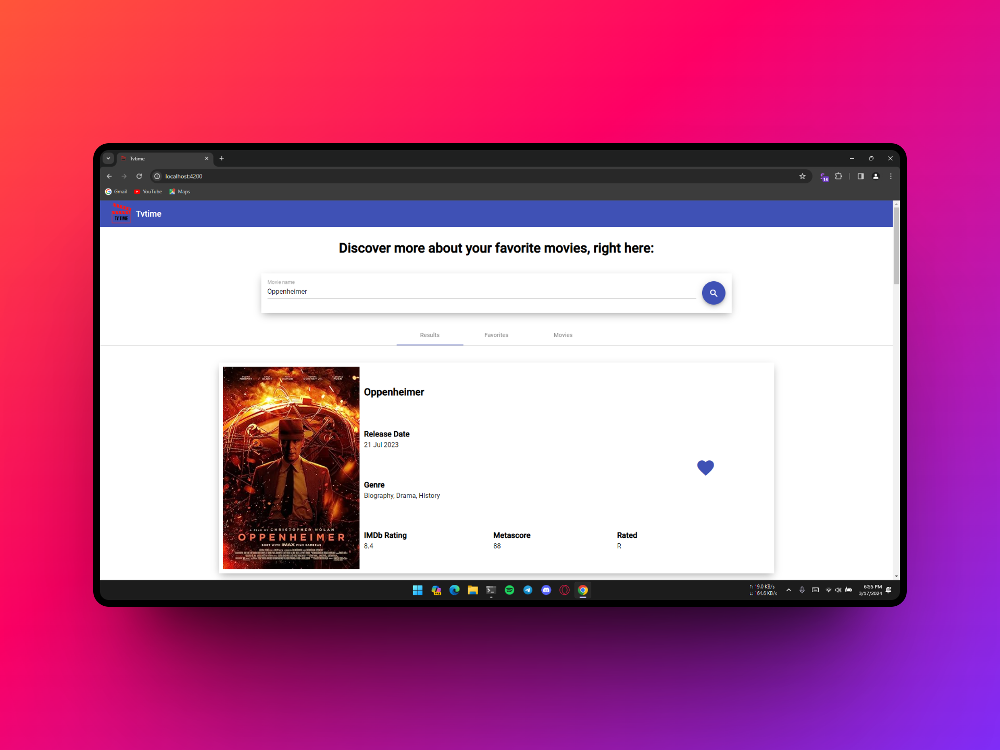
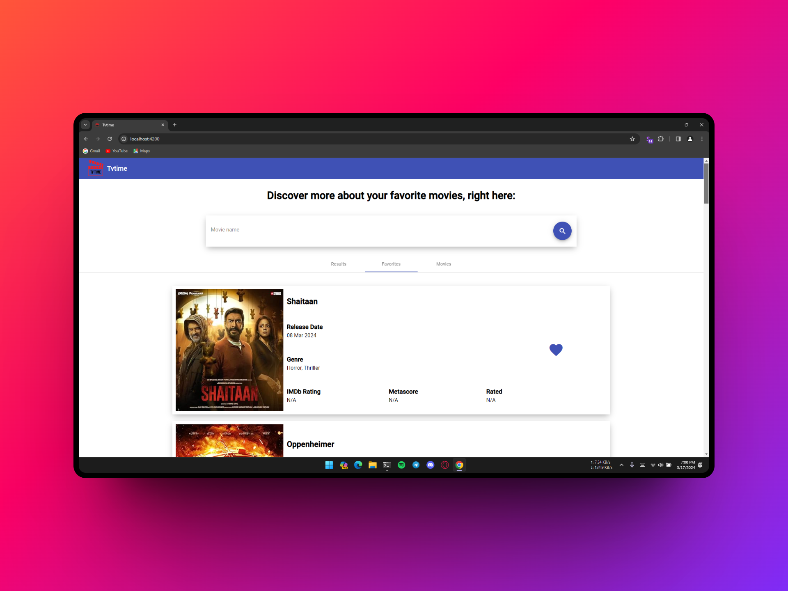
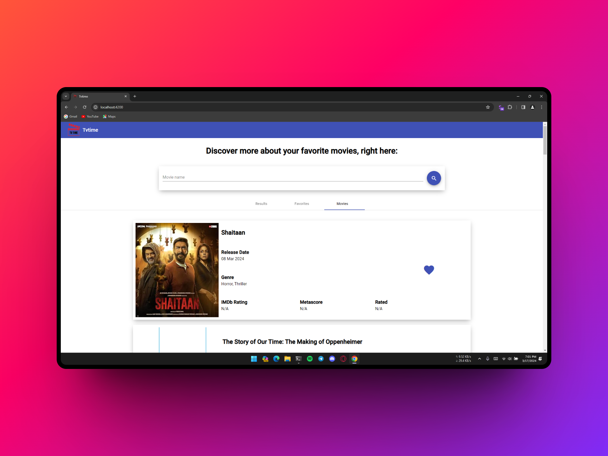
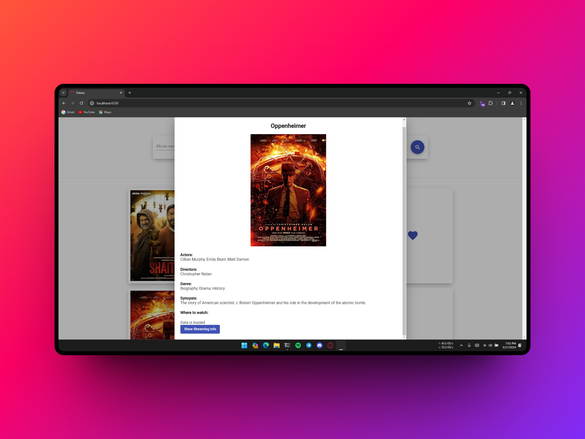
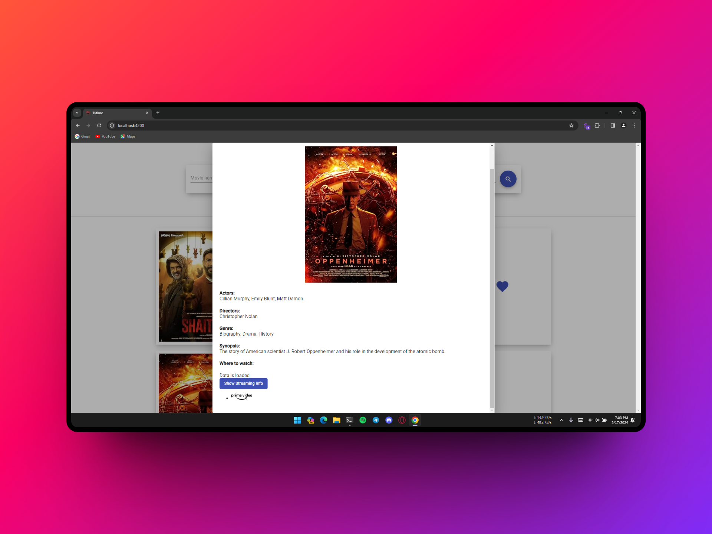

A Movie Watchlist Project using OMDB an IMDb API, Streaming Availability API, Java Spring Boot and Angular

## Api Used

* [OMDB API](http://www.omdbapi.com/)
* [Streaming Availability API](https://rapidapi.com/movie-of-the-night-movie-of-the-night-default/api/streaming-availability/)

## Screenshots

